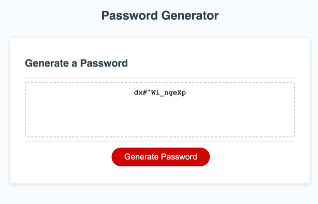

# Password Generator

This application generates a random password based on user's selection of uppercase, lowercase, numeric, and special characters. This application runs in the browser. Selections are made through with pop-up boxes, and the generated password appears in the password-genertor's text area. The HTML is style in CSS, and comes to togethor with Javascript to establish the desired user experience. 

Deployment link: https://sihayah.github.io/password-generator/